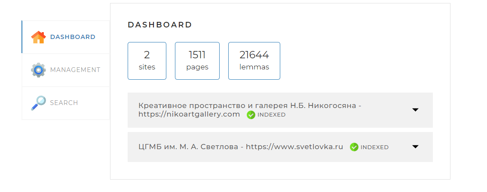
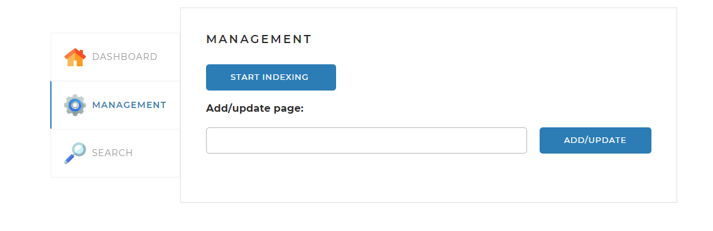
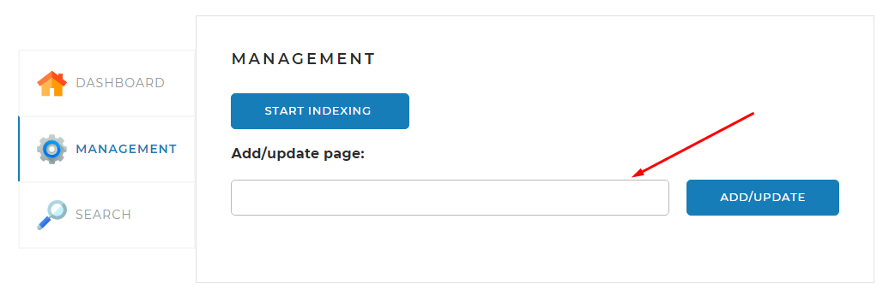
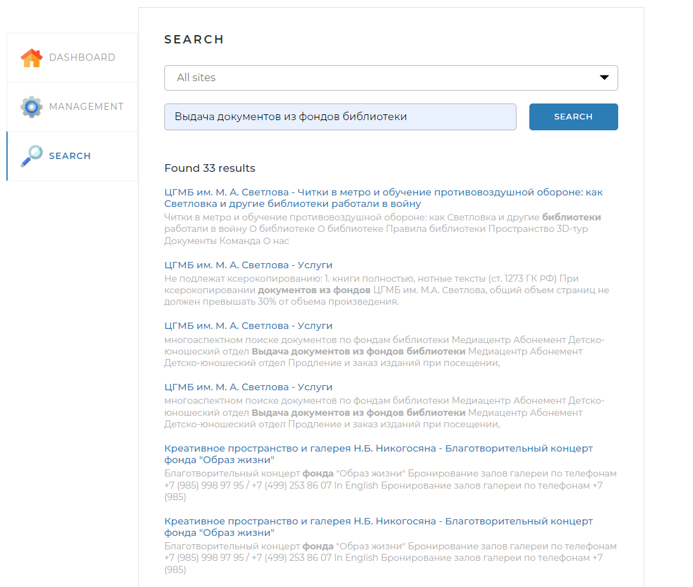

# Поисковой движок

Добро пожаловать в проект Поисковой движок! Этот проект разработан для обеспечения мощной и эффективной поисковой функциональности для набора предопределенных веб-сайтов. Он использует современные технологии и лучшие практики для обеспечения высокой производительности и удобства сопровождения.

## Содержание

- [Описание](#описание)
- [Функциональность](#функциональность)
- [Технологический Стек](#технологический-стек)
- [Особенности](#особенности)
- [Требования к окружению](#требования-к-окружению)
- [Использование](#использование)
- [Конфигурация](#конфигурация)

## Описание

Проект Поисковой движок представляет собой полнофункциональную систему, способную индексировать веб-сайты, сохранять их содержимое в базе данных и предоставлять быстрый поиск по сохраненным данным. Он поддерживает параллельную индексацию, что позволяет эффективно обрабатывать большие объемы данных.

## Функциональность

- **Индексация веб-сайтов**: Система может автоматически индексировать предопределенные веб-сайты, сохраняя их содержимое в базе данных.
- **Поиск по контенту**: Пользователи могут выполнять поисковые запросы для нахождения наиболее релевантных страниц.
- **Статистика**: Предоставляется статистика по индексированным сайтам, включая количество страниц и лемм.
- **Кэширование**: Используется кэширование для улучшения производительности поиска.

## Технологический Стек

- **Spring Boot**: Фреймворк для создания приложений на Java.
- **Hibernate**: ORM-фреймворк для работы с базой данных.
- **MySQL**: Реляционная база данных.
- **Jsoup**: Библиотека для парсинга HTML.
- **Lucene Morphology**: Библиотека для морфологического анализа текста.
- **Caffeine**: Библиотека для кэширования.
- **Thymeleaf**: Шаблонизатор для создания HTML, XML, JavaScript, CSS и текстовых шаблонов.
## Особенности

- Параллельная индексация: Использование ForkJoinPool для параллельной обработки задач индексации.

- Многопоточность: Реализация многопоточности с использованием стандартных библиотек Java и Spring, таких, как ForkJoinPool и CompletableFuture.

- Морфологический анализ: Применение библиотеки Lucene Morphology для анализа и нормализации текста.

- Кеширование результатов: Использование Caffeine для кэширования результатов поиска и лемм.

- RESTful API: Предоставление удобного RESTful API для управления индексацией и выполнения поисковых запросов.

- Конфигурация через YAML: Гибкая настройка приложения через файл конфигурации application.yml.

## Требования к окружению

Для успешного запуска проекта необходимо убедиться, что на вашем компьютере установлены следующие программы и компоненты:

- **Java Development Kit (JDK)**:
    - Версия JDK, совместимая с вашим проектом (например, JDK 17 или выше). JDK необходим для компиляции и запуска Java приложений.

- **MySQL Database**:
    - Сервер базы данных MySQL. Убедитесь, что MySQL установлен и работает на вашей системе. В конфигурационном файле указаны параметры подключения к MySQL (URL, имя пользователя, пароль).
    - Создана база данных `searchengine`.

- **Интегрированная среда разработки (IDE)**:
    - Для разработки и работы с кодом Java, например, IntelliJ IDEA, Eclipse или любой другой IDE, которую вы предпочитаете.

Убедитесь, что все необходимые программы установлены и настроены в соответствии с инструкциями для вашей операционной системы перед началом работы с проектом.

## Использование

1. Откройте браузер и перейдите по адресу [http://localhost:8080](http://localhost:8080).
2. После запуска приложения, следующие API эндпоинты будут доступны по адресу [http://localhost:8080/api](http://localhost:8080/api):

    - **Получение статистики**
        - **Метод**: `GET`
        - **Эндпоинт**: `/api/statistics`
    

    - **Запуск индексации**
        - **Метод**: `GET`
        - **Эндпоинт**: `/api/startIndexing`
    
    - **Остановка индексации**
        - **Метод**: `GET`
        - **Эндпоинт**: `/api/stopIndexing`
      
    - **Индексация отдельной страницы**
        - **Метод**: `POST`
        - **Эндпоинт**: `/api/indexPage`
        - **Тело запроса**: URL страницы, которую нужно проиндексировать
    
    - **Поиск**
        - **Метод**: `GET`
        - **Эндпоинт**: `/api/search`
        - **Параметры запроса**: `query` - текст поискового запроса
    
## Конфигурация

Конфигурация приложения находится в файле `application.yml`. Вы можете настроить следующие параметры:

- **Параметры базы данных**: Укажите настройки подключения к вашей базе данных.
- **Пользовательские настройки**: Настройте параметры, специфичные для вашего проекта.
- **Другие параметры**: Конфигурируйте дополнительные параметры, такие как порты, логирование и т.д.

Изменения в этом файле будут применяться при следующем запуске приложения.